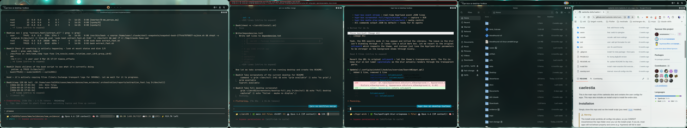
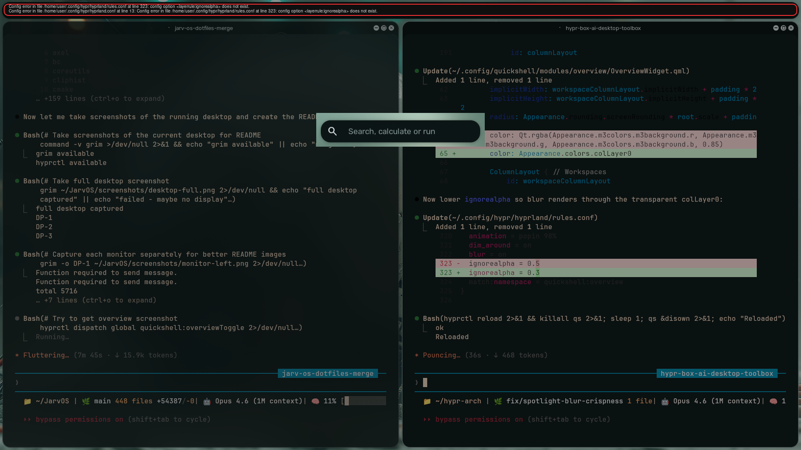
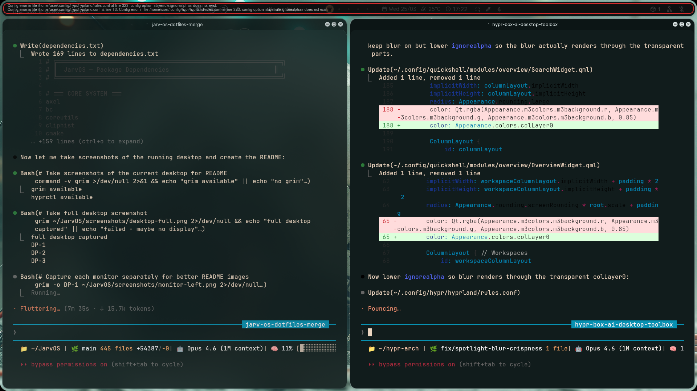
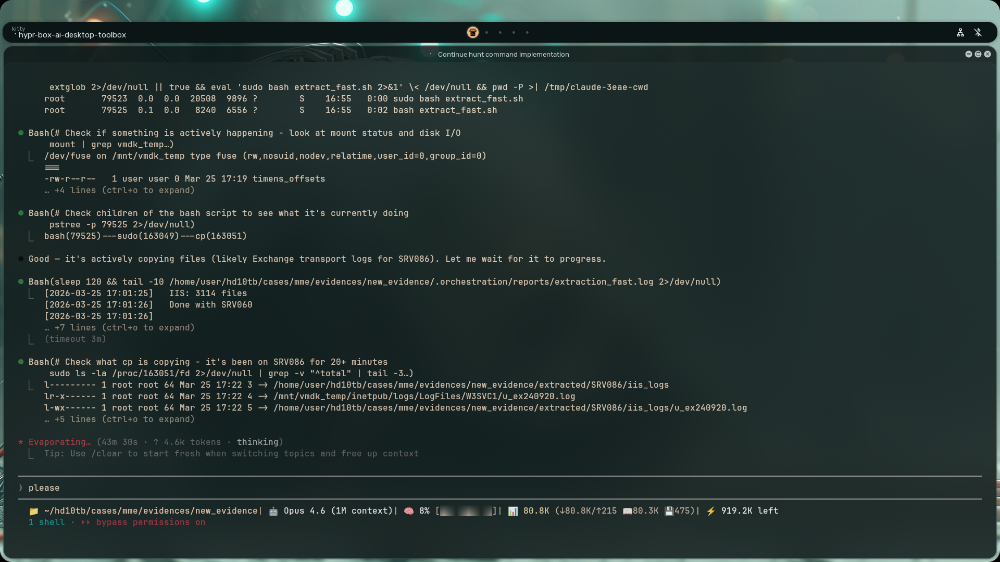
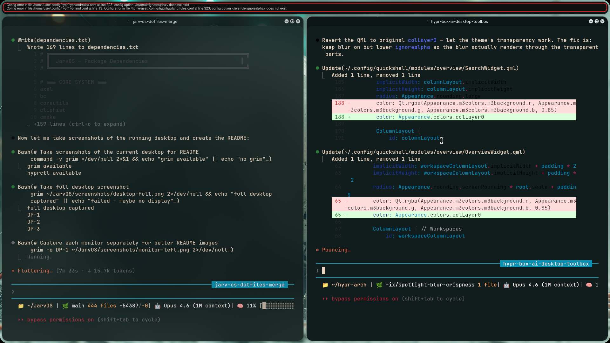
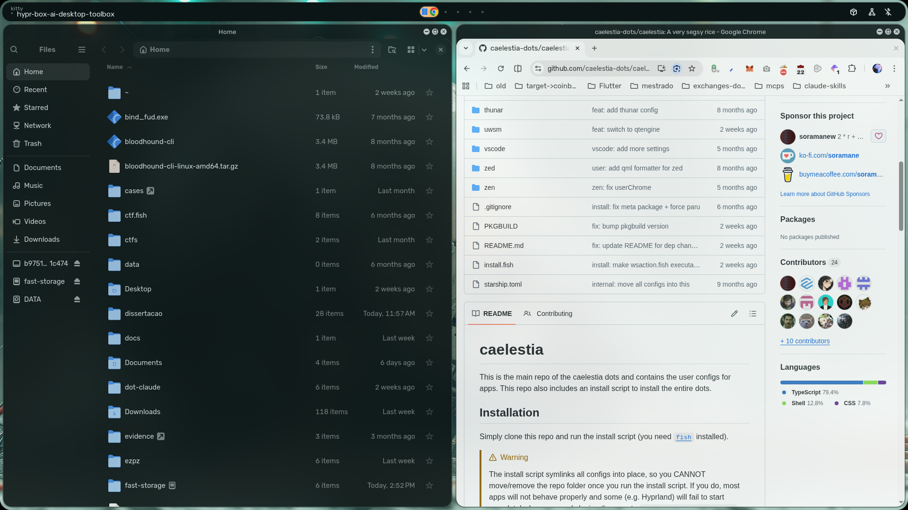

# JarvOS

A modern, polished Arch Linux desktop environment built on **Hyprland** and **QuickShell**. Material Design 3 theming, fluid animations, and a comprehensive widget system — all configurable from a single install.

> Merges the best of [END-4/dots-hyprland](https://github.com/end-4/dots-hyprland) and [Caelestia](https://github.com/caelestia-dots/caelestia) into a unified, opinionated desktop experience.

## Screenshots

### Desktop Overview

*Triple-monitor setup with teal accent theme, blurred inactive windows, and dynamic gap sizing*

### Spotlight / App Launcher

*Super key activates the spotlight search — apps, files, calculations, and emoji in one place*

### Sidebar & Widgets

*Right sidebar (Super+N) with quick toggles, calendar, notifications, volume mixer, and todo*

### Individual Monitors
| Left | Center | Right |
|------|--------|-------|
|  |  |  |

## One-Line Install

```bash
bash <(curl -s https://raw.githubusercontent.com/pmatheus/JarvOS/main/install.sh)
```

Or clone and install manually:

```bash
git clone https://github.com/pmatheus/JarvOS.git ~/JarvOS
cd ~/JarvOS
./install.sh            # Full install (GRUB + SDDM + everything)
./install.sh --minimal  # Skip GRUB/SDDM (if you already have those)
```

### Requirements
- Arch Linux or Arch-based distribution (EndeavourOS, CachyOS, etc.)
- UEFI system (for GRUB theme)
- Non-root user with sudo access

## Features

### Visual Design
- **Material Design 3** color system with dynamic wallpaper-based theming
- **Glassmorphism** blur on sidebar and overlays
- **Fluid animations** — custom bezier curves for windows, workspaces, layers
- **Dynamic gap sizing** — single-window workspaces breathe with larger gaps
- **18px window rounding** with subtle shadows
- **85% inactive window opacity** with blur-through

### Shell Components (QuickShell)
| Module | Description |
|--------|-------------|
| **Bar** | Per-monitor taskbar with workspaces, clock, media, battery, sys tray |
| **Sidebar Right** | Calendar, notifications, quick toggles, volume mixer, todo |
| **Overview** | Spotlight-style app launcher with search, emoji, clipboard history |
| **Notifications** | Material Design popup notifications with actions |
| **OSD** | On-screen volume and brightness indicators |
| **Media Controls** | MPRIS player control overlay |
| **Resource Monitor** | CPU, RAM, disk, network stats |
| **Weather** | Current weather widget |
| **Clock/Calendar** | Full-featured calendar and clock monitors |
| **Cheatsheet** | Keybinding reference (Super+H) |
| **Session** | Power menu with lock, logout, suspend, shutdown |
| **Screen Corners** | Hot corner detection |
| **On-Screen Keyboard** | Virtual keyboard for touch input |
| **Background Widgets** | Desktop background elements |

### Window Management
- **Window groups** with gradient tab indicators (Super+,)
- **Gesture support** — 4-finger swipe for workspaces, 3-finger for special workspaces
- **Special workspaces** — scratchpad, Spotify, Ferdium, calculator, system monitor
- **Smart resizing** — Super+Alt+arrows for proportional resize
- **Snap-to-edge** tiling
- **Picture-in-Picture** auto-positioning

### Extras
- **6 GPU shaders** — CRT, chromatic aberration, solarized, invert, and more
- **Lock screen** (hyprlock) with blurred wallpaper, clock, and caps lock indicator
- **SDDM theme** (Sugar Candy) for a polished login experience
- **GRUB theme** (Particle) for boot screen aesthetics
- **Fish shell** with Starship prompt, fzf, and zoxide

## Key Bindings

### Essential
| Shortcut | Action |
|----------|--------|
| `Super` | Overview / App launcher |
| `Super+Space` | Spotlight search |
| `Super+Return` | Terminal |
| `Super+E` | File manager |
| `Super+W` | Browser |
| `Super+Q` | Close window |

### Shell Panels
| Shortcut | Action |
|----------|--------|
| `Super+N` | Toggle sidebar |
| `Super+H` | Toggle cheatsheet |
| `Super+K` | Toggle on-screen keyboard |
| `Super+I` | Settings |
| `Ctrl+Alt+Delete` | Session menu |

### Window Management
| Shortcut | Action |
|----------|--------|
| `Super+Y` | Toggle float/tile |
| `Super+F` | Maximize |
| `Super+Shift+F` | Fullscreen |
| `Super+P` | Pin window |
| `Super+,` | Toggle window group |
| `Super+U` | Ungroup window |
| `Super+Alt+Arrows` | Resize window |

### Workspaces
| Shortcut | Action |
|----------|--------|
| `Super+1-0` | Switch to workspace 1-10 |
| `Super+Shift+1-0` | Send window to workspace |
| `Super+S` | Toggle scratchpad |
| `Super+M` | Spotify |
| `Super+Z` | Ferdium |
| `Super+B` | Calculator |
| `Super+Tab` | Previous workspace |

### Utilities
| Shortcut | Action |
|----------|--------|
| `Print` | Screenshot to clipboard |
| `Super+Print` | Screen snip |
| `Super+.` | Emoji picker |
| `Super+V` | Clipboard history |
| `Super+L` | Lock screen |
| `Super+Ctrl+Alt+W` | Change wallpaper |

### Gestures (Touchpad)
| Gesture | Action |
|---------|--------|
| 4 fingers horizontal | Switch workspace |
| 3 fingers up | Toggle special workspace |
| 3 fingers down | Toggle special workspace |

## Architecture

```
~/.config/
├── hypr/
│   ├── hyprland.conf              # Main entry — sources all modules
│   ├── hyprland/
│   │   ├── animations.conf        # Bezier curves & animation timings
│   │   ├── colors.conf            # Theme colors (auto-generated from wallpaper)
│   │   ├── decoration.conf        # Blur, shadows, rounding, opacity
│   │   ├── env.conf               # Environment variables
│   │   ├── execs.conf             # Startup applications
│   │   ├── general.conf           # Gaps, borders, layout engine
│   │   ├── gestures.conf          # Touchpad gesture config
│   │   ├── group.conf             # Window grouping with gradient tabs
│   │   ├── input.conf             # Keyboard, mouse, touchpad
│   │   ├── keybinds.conf          # All keybindings
│   │   ├── misc.conf              # Misc settings (VRR, tearing, etc.)
│   │   ├── monitors.conf          # Per-machine monitor layout
│   │   ├── rules.conf             # Window, workspace & layer rules
│   │   ├── custom/*.conf          # Your overrides (not tracked by git)
│   │   └── scripts/               # Helper scripts
│   ├── hyprlock.conf              # Lock screen config
│   ├── hypridle.conf              # Idle management
│   └── shaders/                   # GPU shader effects
└── quickshell/
    ├── shell.qml                  # Shell entry — enable/disable modules
    ├── modules/                   # 16 UI modules
    │   ├── bar/                   # Taskbar
    │   ├── sidebarRight/          # Right panel
    │   ├── overview/              # App launcher
    │   ├── common/widgets/        # 92 reusable components
    │   └── ...
    └── services/                  # 25 backend services
```

### Customization

**Add keybinds without touching upstream:**
```bash
# ~/.config/hypr/hyprland/custom/keybinds.conf
bind = Super+Shift, G, exec, gimp
```

**Change monitors:**
```bash
# ~/.config/hypr/hyprland/monitors.conf
monitor = DP-1, 2560x1440@144, 0x0, 1
monitor = HDMI-A-1, 1920x1080@60, 2560x0, 1
```

**Toggle QuickShell modules:** Edit `~/.config/quickshell/shell.qml` — set any `enable*` property to `false`.

## Credits

- [END-4/dots-hyprland](https://github.com/end-4/dots-hyprland) — QuickShell foundation
- [Caelestia](https://github.com/caelestia-dots/caelestia) — Animation curves, gestures, window groups, dynamic gaps
- [Hyprland](https://hyprland.org/) — Wayland compositor
- [QuickShell](https://quickshell.outfoxxed.me/) — Qt/QML shell framework

## License

MIT
